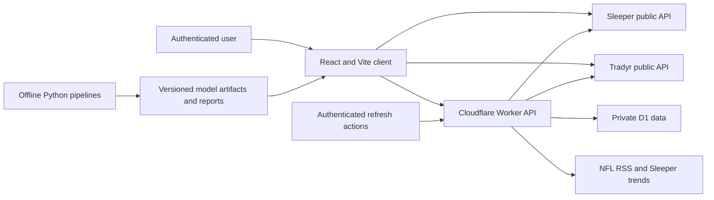

# Architecture

## System purpose

RosterLab is a private dynasty-fantasy research desk for Sleeper leagues. It
combines public league state, attributed dynasty market prices, offline model
artifacts, completed-trade history, and time-sensitive news evidence. It helps
the user compare teams and proposed trades without presenting an unvalidated
profit, acceptance, or certainty score.

The application is intentionally a modular monolith: one React application,
one Cloudflare Worker boundary, one D1 database, and offline Python model
pipelines. Independent services have not earned their operational cost.

## Runtime map

The browser performs current public league and market reads. Identity-aware,
user-specific, persisted, or user-triggered collection stays behind the Worker.
Offline training does not run in the request path.

## Repository surfaces

| Path | Responsibility |
|---|---|
| `src/App.tsx` | League loading, shared preferences, navigation, and view composition |
| `src/views/` | Stateful UI for each product tab; one focused module per view |
| `src/components/` | Small presentation helpers shared across views |
| `src/styles/` | View-owned journal and evidence styles; `src/styles.css` retains shared and older view rules |
| `src/api.ts` | Browser-side adapters for Sleeper, Tradyr, static artifacts, and private Worker routes |
| `src/types.ts` | Shared browser/domain data contracts |
| `src/rankings.ts` | Team construction, direct rankings, and source-separated trade scenarios |
| `src/team-power.ts` | Reusable legal-lineup optimizer, redraft power table, coverage, and trade deltas |
| `src/strategy.ts` | Declared roster strategy, bounded package enumeration, and deterministic Pareto discovery |
| `src/counterparty-utility.ts` | League-relative seller roster facts and bounded three-way bridge candidates, kept separate from price and acceptance |
| `src/player-research.ts` | Pure league-scoped player dossier and restorable league/player address contract; no fetching or valuation rules |
| `src/catalyst-timing.ts` | Current report-to-player joins and descriptive event cohorts with a hard model-promotion gate |
| `src/pick-opportunity.ts` | Pick price-range and pipeline-derived rookie opportunity read without converting prospect production to value |
| `src/decision-journal.ts` | Portable private proposal, evidence-snapshot, thesis, hold, exit, and status contracts |
| `src/leagues/` | Fixed-league private decision policies; shared dispatch with separate Phil power-climb and BC value-build rules |
| `src/trade-models.ts` | Portable exchange/outcome model contracts, consolidation features, and user-authored weighting arithmetic |
| `src/edge.ts` | Evidence-board opportunity construction and market-tape preparation |
| `src/dislocations.ts` | Current source disagreement, position-relative production divergence, owner-pressure facts, and their evidence-only Pareto frontier |
| `src/intel*.ts` | Headline classification and roster-aware intel signals |
| `src/journal.ts` | Completed-trade presentation and season-specific identity remapping |
| `src/research.ts` | Browser representation of historical research state and gates |
| `worker/index.ts` | Route dispatch and static asset fallback |
| `worker/routes/` | Authenticated capability handlers |
| `worker/generated/` | Sanitized generated artifacts bundled only into authenticated Worker routes |
| `worker/http.ts` | Shared HTTP boundary helpers |
| `worker/intel-feed.ts` | RSS and Sleeper trend collection adapter |
| `worker/*-store.ts` | D1 schemas, normalization, persistence, refreshes, and read models by capability |
| `db/schema.ts` | Drizzle schema used to generate checked-in migrations |
| `drizzle/` | Ordered D1 migrations shipped with the Sites build |
| `ml/` | Offline production, rookie, source-audit, historical trade, return, and evaluation pipelines; `asset_potential.py` is a blocked shadow experiment and has no runtime consumer |
| `public/data/` | Browser-safe generated artifacts for models intentionally public to the deployed asset layer |
| `.openai/hosting.json` | Logical Sites project and D1 binding declaration |
| `build/sites-vite-plugin.ts` | Copies Sites configuration and migrations into the deployment bundle |

## Client flow

`App` uses a progressive client flow so the default league-facts screen is not
held behind data or code owned by another view:

1. `fetchLeagueBundle` reads the league, rosters, managers, traded picks, and
   current draft from Sleeper. After the first visit, the device-local last
   league selection lets this read overlap the authenticated preference read.
2. `fetchValues` reads attributed dynasty player and pick composites from
   Tradyr, while `fetchCurrentSeasonValues` separately reads the same-format
   redraft player bucket.
3. `fetchProjections` loads the browser-safe production artifact. Those three
   inputs are sufficient to build teams, lineups, and league-relative rankings,
   so React renders the first useful screen immediately after they resolve.
4. Optional Sleeper role and injury metadata is hydrated from one bulk catalog
   request only when Trade Lab or Evidence needs it. It never blocks current
   ownership or market values and no per-roster-player request fan-out is
   permitted.
5. Trade Lab, Journal, News, Evidence, Rookie board, and Model code is split by
   view. Model health, rookie evidence, event health, and the stored journal load
   only when their owning view opens.
6. A full multi-season journal sync is manual. Evidence snapshots and research
   state remain owned by the Evidence view, whose Pareto frontiers use only
   inspectable objectives and do not claim acceptance or return probabilities.

All live league views use the current Sleeper roster and traded-pick ledger as
their single source of ownership truth. RosterLab does not persist or project
accepted offers during Sleeper's review window because the public API does not
provide a reliable lifecycle for keeping that private state current.

League policy composes with the shared engines instead of entering them. Both
private teams use the same legal-lineup optimizer, source-separated trade
scenario, draft ownership, and Pareto package search. Emperor Phil declares a
current-power climb policy; BC declares a value-build policy and deterministic
trade veto. Neither policy changes provider prices, projection outputs, or the
meaning of Pareto support. A new policy kind must earn a concrete decision rule
rather than expanding into a general strategy language.

The primary views are league facts, player research, Trade Lab, Journal, News,
Evidence, Rookie board, and Model. View-local presentation should consume typed domain results
instead of reimplementing ranking or valuation rules in JSX.

## Worker API boundaries

| Route | Methods | Persistence | Identity behavior |
|---|---|---|---|
| `/api/preferences` | `GET`, `PUT` | D1 | Requires hosted identity; localhost uses the explicit development identity |
| `/api/journal` | `GET`, `POST` | D1 | Requires identity; POST is same-origin and syncs completed Sleeper trades |
| `/api/alerts` | `GET`, `POST` | D1 | Requires identity; materializes private watchlist alerts |
| `/api/edge` | `GET`, `POST` | D1 | Requires identity; stores private market tape and advances the resumable team-history backfill |
| `/api/research` | `GET`, `POST` | D1 | Requires identity; syncs and reads historical evidence |
| `/api/trade-tape` | `GET`, `POST` | D1 | Requires identity; POST refreshes the bounded FantasyCalc tape; `GET ?format=training` downloads the sanitized content-addressed tape |
| `/api/decisions` | `GET`, `POST`, `PATCH` | D1 | Requires identity; stores and updates the user's private pre-trade decision record and exact evidence snapshot |
| `/api/intel` | `GET` | None | Requires identity; generic feed is cached privately for five minutes |
| `/api/rookies` | `GET` | None | Requires identity; returns the checked-in sanitized rookie-production artifact with no-store caching |

Write routes reject cross-origin requests. Private JSON responses use
`Cache-Control: private, no-store` and `X-Content-Type-Options: nosniff`.
Authentication is supplied through hosted `oai-authenticated-user-*` headers;
application code must not invent or trust browser-submitted identities.

`worker/index.ts` contains only route dispatch and asset fallback.
`worker/routes/` owns capability handlers, `worker/http.ts` owns
shared response and request-boundary helpers, and `worker/intel-feed.ts`
contains the imported RSS and Sleeper trend collection behavior.

## Persistence

D1 contains several bounded capability groups:

- user league preferences and strategy overrides;
- linked league seasons, season-specific owner identities, completed trades,
  trade-value snapshots, ingestion-time roster contexts, and outcome checkpoints;
- canonical intel events and per-user alert state;
- dated market values, learning reports, and historical-source audits;
- the deduplicated FantasyCalc completed-trade tape and observable refresh runs;
- historical league/player/news research tape and its coverage runs;
- exact Sleeper weekly roster states joined to a bounded, weekly sampled
  FantasyCalc player-value tape for reconstructed team research;
- private proposed-trade decisions, immutable captured evidence JSON, written
  thesis/hold/exit conditions, and lifecycle status.

Historical roster IDs are scoped to a Sleeper league season. Never resolve an
old roster ID through the current season without mapping the historical
`owner_user_id` to that season first.

The schema currently has two representations: Drizzle definitions/migrations
under `db/` and `drizzle/`, plus defensive `CREATE TABLE IF NOT EXISTS`
statements in Worker stores. Until those are consolidated, every schema change
must update and test both representations. Divergence is a known risk, not a
feature.

The deprecated `user_trade_offers` declaration remains in the Drizzle schema
only to avoid turning this UI/runtime deletion into a destructive data
migration. No Worker route reads from or writes to it.

`db/schema-parity.test.ts` now fails if those representations diverge. The two
declared migration-only tables are `season_users`, superseded by season-scoped
identity in `season_rosters`, and `edge_opportunity_snapshots`, whose
unvalidated projection writer and reader were removed. Runtime table creation
can be removed only after clean and existing D1 migration rehearsals both
succeed.

## Refresh work

OpenAI Sites production logs did not show invocations for the repository's
configured cron handler during the window we inspected, so runtime correctness
does not depend on unproven background execution. Refreshes are observable and
user-triggered:

- News refreshes only when its private inbox is due and requested.
- The Evidence view writes the current league tape and advances one bounded
  historical-source batch when opened with fresh evidence.
- A team page can explicitly start, resume, or refresh its historical player
  tape. Each request advances at most twelve players and persists progress, so
  no scheduler or always-on collector is required.
- Research and the Sleeper journal have explicit same-origin sync actions.
- Trade Lab's historical-tape button scans a fixed FantasyCalc anchor sample,
  deduplicates completed trades, and records success, partial failure, or error.

These triggers may refresh evidence; they cannot execute trades, contact other
managers, train sklearn inside a request, or promote an artifact. If Sites later
supports observable schedules, a schedule may call these same capability
functions without creating a second collection architecture.

## Model boundary

Python model pipelines run offline and export small, versioned artifacts. The
application only uses a model for a claimed decision when its declared
out-of-time gate passes. Production forecasts, rookie-production evidence,
market-return research, and news events are distinct targets and must remain
distinct in types, reports, and UI language.

See [Data and models](data-and-models.md) for the full promotion rules.

## Hosting and deployment

Vite builds the React client and Cloudflare Worker-compatible server bundle.
The Sites plugin copies `.openai/hosting.json` and D1 migrations into
`dist/.openai`. Sites owns the hosted D1 resource and deployment wiring.

Feature branches are validated locally and submitted as pull requests. A PR is
not a deployment, and agents must not deploy or merge without explicit user
direction.

## Architectural invariants

1. External provider logic stays at adapters or Worker stores, not inside UI
   components.
2. Pure ranking and trade functions stay deterministic for identical inputs.
3. Public current market value, production projection, news evidence, and
   historical outcome are separate concepts.
4. Every historical observation retains its date, source, and identity scope.
5. Missing data remains visible; it is never replaced with favorable fictional
   evidence.
6. User-private state stays behind authenticated Worker routes and is keyed by
   both user and league where appropriate.
7. Offline models cannot silently promote themselves into trade logic.
8. New infrastructure requires an observed need and an explicit removal or
   ownership story.
9. Current Sleeper roster and pick ownership is the only live inventory state;
   private offers are never projected as settled facts.
