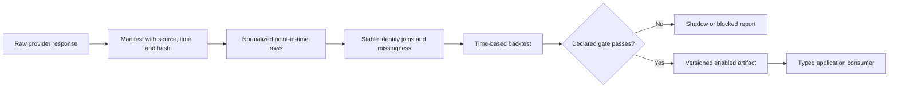

# Data and models

## Evidence taxonomy

RosterLab uses several kinds of evidence. They are intentionally not
interchangeable.

| Evidence | Primary meaning | Current application role |
|---|---|---|
| Sleeper league state | Current rosters, settings, owners, draft, and traded-pick ownership | Team construction and league context |
| Tradyr composite | Attributed current dynasty market comparison | Player/pick market values and trade comparison |
| Tradyr redraft composite | Same-format current-season market consensus | Best-legal-lineup power index and trade power delta |
| NFL production model | Expected next-season PPR points per NFL team game | Projected lineup impact when its gate passes |
| Rookie production model | Expected position-relative rookie-season PPR production | Current-class board plus advisory exact-slot opportunity baskets; never pick price or profit |
| Future rookie-class tape | Same-horizon prospect population and source coverage | Private block-status evidence only; no future pick valuation while its pinned source is missing |
| News and trends | Time-sensitive factual catalyst evidence | Advisory signals and watchlist alerts |
| Completed-trade journal | Factual league transaction ledger | Historical manager context and outcome tracking |
| Historical market tape | Dated market observations | Calibration and shadow learning research |
| Trade outcomes | Change after an observed entry snapshot | Evaluation at declared checkpoints |
| Exchange-premium tape | Accepted 1-for-2/3 package price at the trade date | Separately gated consolidation research |
| Trade outcome challengers | 90/180/365-day elite-side return minus package-side return | Structure-only versus premium-aware held-out research |

A market composite is not a production forecast. Production is not resale
profit. News is not causation. A completed trade is not evidence of every
rejected negotiation.

## Source boundaries

### Sleeper

Sleeper's public API supplies league facts, rosters, users, transactions,
trending additions/drops, drafts, and current traded-pick ownership.

Important identity rule: a `roster_id` belongs to one league-season. Follow
`previous_league_id` and store season-specific roster-to-owner mappings before
comparing historical behavior with current managers.

Sleeper does not expose private chat, direct messages, rejected offers,
counters, or negotiation rationale through the public API. RosterLab does not
persist or project those records, and the journal contains completed trades
only.

### Tradyr

Tradyr provides permitted, attributed composites derived from public market
sources. The application reads dynasty player/pick values for asset and trade
comparisons and separately reads the matching redraft player bucket for the
current-season lineup-power index. KeepTradeCut is not scraped directly.

The power index is the direct sum of redraft composites in the best legal
QB/RB/WR/TE/FLEX/SUPER_FLEX lineup. It is a same-format relative market proxy,
not projected fantasy points. Missing redraft coverage stays missing and is
shown as slot coverage; dynasty value is never used as a power fallback.

Store the provider's generation/version timestamp with observations. A current
composite captured during a historical backfill is retrospective and cannot be
called the original trade price.

### Future picks today

Sleeper determines factual pick identity and ownership: the pick remains tied
to its original roster ID even after its current owner changes. An exact slot is
used only when the current draft supplies a slot-to-roster mapping.

For an unresolved future pick, the application currently uses the matching
Tradyr middle-tier average as its neutral expected value and retains the
provider-derived early-to-late range. Manager-direction labels are manual
context or a neutral placeholder and do not alter that value. This is not a
pick-slot forecast; a class-strength or original-owner forecast must remain
blocked until its own historical model passes validation.

### News and trends

The Worker reads configured NFL RSS sources and Sleeper trend endpoints. It
normalizes headlines, collapses likely duplicates, applies a bounded factual
event classifier, and stores only confidently matched events for alerts.

Source reliability constants and headline rules are advisory heuristics, not a
trained return model. They cannot change market price or a production forecast
without a separate historical validation gate.

### Offline football data

The Python pipelines use source-specific adapters and local ignored caches.
Current sources include nflverse stats/combine data, cfbfastR college
play-participant data, DynastyProcess/FantasyPros historical ECR snapshots, and
bounded FantasyCalc source research. Each report records provider, retrieval
date, and available source hashes.

## Trade scenarios and Pareto discovery

The Trade Lab evaluates an explicit package through separate factual lenses:

- the literal sum of current Tradyr composites;
- KTC and FantasyCalc player-value package lenses only for player-only trades
  when every player has the corresponding provider value. Any pick makes these
  provider-scale package totals unavailable because picks have no value on
  either provider's player scale;
- the provider-derived early-to-late range for unresolved picks;
- floor, expected, and ceiling lineup deltas from the enabled production
  artifact;
- the current-season power change from the same-format redraft lineup before
  and after the trade;
- current draft-capital flow, roster-space change, and player age at the
  user's declared horizon.

For 1-for-2 and 1-for-3 proposals, a separate historical panel may also show
the proposed package's raw premium and the status of the exchange-premium and
outcome tapes. It never adds a hidden package adjustment to the direct provider
sum. A user may save explicit weights for promoted lenses; missing weight is
reported rather than redistributed. See [Historical trade models](trade-models.md).

Production scenarios use a strict likely-lineup coverage guard. The current
market-selected lineup before and after the deal must fill every required skill
slot with an enabled projection. Otherwise the corresponding result is null and
the UI displays the observed slot coverage. Market value is never converted
into fallback fantasy points.

Discovery does not collapse those lenses into a score. For a selected target
basket, the application enumerates one-to-three-asset outgoing combinations,
using up to the roster's 50 highest-priced assets, keeps the 60 closest
current-value packages, and marks the non-dominated Pareto set. League-wide
discovery pairs each priced target with its closest package from the same
bounded outgoing pool and returns the non-dominated set across the visible
current-value, lineup-coverage, and declared-window objectives. Deterministic
display ordering is a tie-break only. Neither frontier estimates acceptance or
resale return.

V7.8 adds an actionable layer beside the raw league-wide frontier. Package
enumeration produces one candidate for every priced opponent target; the
actionable screen evaluates that full population while the raw Pareto display
remains a separately truncated comparison surface. The screen uses only the
current league population, the declared team horizon, and the promoted 30-day
return artifact to build three named books: long-term compounders, catalyst
flips, and liquidity conversions. A target must pass every displayed gate for
its book. Materiality, age, covered trade frequency, tracked drawdown, package
return P&L, draft-capital flow, and current market net remain visible facts;
they are never blended into a target score. League-relative thresholds are
recalculated from the loaded league and candidate package population.

Compounders must also keep tracked package downside at or above the full
candidate median. Player-based liquidity conversions require both non-negative
promoted carry and the same package-downside guard; draft picks remain separate
liquidity instruments and do not receive a player-return fallback.

The actionable book is a selection policy, not a new trained model. It adds no
collector, storage, scheduled process, acceptance probability, or long-term
return claim. Its holding period and exit condition are decision rules for the
thesis, not forecasts.

V7.9 decorates the existing ambitious/fair/walk-away price ladder with a
counterparty read. Position value, optimized starters, pick-value share, and
completed-trade counts are current factual inputs. Need and surplus mean only
below or above the loaded league median; they are not psychological labels.
When every direct package misses those visible utility facts, the client may
show at most two market-balanced three-way bridge candidates. The ledger must
sum to zero, and the candidate remains a research lead rather than an
acceptance prediction.

V8.0 stores a private decision journal record before negotiation. The record
captures the exact asset IDs and displayed values, current market net, covered
lineup and power deltas, provider comparisons, pick flow, promoted 30-day
return evidence, strategy horizon, model versions, dated catalysts, thesis,
hold period, exit condition, and lifecycle status. This is first-party outcome
instrumentation; it does not reconstruct offers or intent from Sleeper.

V8.1 joins current reports for incoming players to descriptive 30-day private
event cohorts. The production-event model and the market-return event model
retain independent gates. Because the present market artifact does not isolate
incremental event lift, catalyst timing cannot reorder targets or change price.

V8.2 keeps draft-pick price and rookie opportunity separate. For an exact
current-class slot, the pipeline publishes a bounded candidate union under its
declared availability rules together with position-relative expected rookie
production. The failed exact 1.12 richer-model gate remains visible, so this is
advisory. An unresolved current pick has no candidate basket. Future classes
return only their pipeline-derived readiness or block reason; missing
same-horizon evidence never becomes a hand-authored ranking.

The private Emperor Phil profile adds a declared top-six objective and explicit
move, timing, and protected-pick gates. The BC profile instead declares a
top-eight starter/power readiness gate, protected pick liquidity, and a hard
veto when a package simultaneously loses current market value, current-season
power, and net draft capital. The Burden first-round pick swap and the McCarthy deal
are regression cases for that rule. Policies are isolated under `src/leagues/`;
the reusable lineup-power, trade-evidence, and Pareto calculations contain no
league-specific thresholds or roster identities. Policy decisions consume the
visible lanes after calculation and never reprice them or create a trade grade.

## Current-state market dislocations

The Evidence view includes a player-only research desk that keeps three kinds
of current evidence separate:

- **Market-source disagreement:** each provider's player rank percentile inside
  the same current dual-covered league player pool. The absolute percentile
  gap and both ranks are shown; raw KTC and FantasyCalc values remain on their
  original, non-comparable scales.
- **Production divergence:** the enabled production model's percentile minus
  the current composite-market percentile within the same position and the
  same rostered, covered population. The UI retains each rank and population. This is
  modeled production evidence, not a market-return forecast.
- **Owner pressure:** whether the player appears in the owner's current-value
  likely lineup, same-position roster count, exact dedicated slots, strict
  production-covered lineup deltas, and completed-trade activity/current-value
  flow from the existing manager context. Flex eligibility is explicitly separate, and none
  of these facts estimates willingness to accept.

The desk provides separate source-gap, production-ahead, and owner-pressure
lenses. Its supported frontier compares only the visible measured objectives:
source rank-percentile gap, within-position production percentile gap, covered lineup effects, likely
lineup status, positional depth, recent completed-trade count, and—when the
user declares a rebuilding or retooling objective—age at the declared horizon.
Missing source or lineup evidence is not imputed. The population is current
priced skill-position players on opponent rosters; deterministic ordering is a
display tie-break, not a composite edge score.

This surface adds no new provider, storage, scheduled job, or model promotion.
It turns already available current facts into research leads that can be opened
in the existing package simulator.

## Data lifecycle

Raw and processed research data remain under ignored paths such as `data/raw`,
`data/processed`, and `ml/artifacts`. Small aggregate reports and deliberately
browser-safe artifacts are committed.

## Veteran production model

The production pipeline predicts next-season PPR points per NFL team game from
prior production, usage, availability, age, and development context. It uses a
later untouched season for the promotion gate and compares against the best
declared simple baseline.

Artifacts:

- `public/data/player-projections.json`
- `public/data/model-health.json`
- `ml/reports/latest.json`

Only an enabled artifact may affect projected lineup impact. It does not change
the player's Tradyr market composite.

## Rookie production model

The rookie pipeline is separate because incoming rookies have no prior NFL
season. Its production target is position-relative rookie regular-season PPR
percentile, including players with zero NFL stats.

The currently validated V6.3 decision rule applies only to the basket of the
eight highest predictions after rookie market rank 24. It does not validate a
selection at a known rookie pick. Rolling class evaluation compares that basket
with simple market, NFL draft order, and market-versus-capital-gap rules. The
current report passed this declared sleeper-basket gate.

The offline V6.3 known-pick extension separately simulates slots 1-24, with
special reporting for 1.08-2.04. It reports each held-out class, hindsight
selection regret, positional slices, and sensitivity to whether prior picks
follow market order, NFL draft order, or learned market-plus-capital order. The
learned market-plus-capital model is the primary baseline and advisory decision
model. College and athletic feature families are not promoted for a known slot
unless they add repeatable value for that exact decision.

Artifacts and reports:

- `ml/reports/rookie-model-latest.json`
- `ml/reports/rookie-model-latest.md`
- `ml/reports/rookie-known-pick-latest.json` (offline shadow/advisory contract)
- `ml/reports/rookie-complexity-ledger.md`
- `worker/generated/rookie-board.json`

The pipeline derives both the Worker-only artifact and the offline known-pick
artifact from the same in-memory report; neither is hand-edited. The
authenticated `GET /api/rookies` route returns only
the versioned production board, aggregate validation, evidence fields used by
the UI, and active blockers. Raw rows, provider payloads, model binaries, and
shadow market-return forecasts are excluded. The Rookie board remains advisory
and does not alter `Asset.value`, trade scoring, packages, or future-pick values.
The known-pick artifact is not served by the Worker. Its production percentile
is never converted into dynasty value, pick value, or profit.

The 180/365-day market-return head remains shadow-only because the target is
expert-consensus movement rather than a complete price tape from actual
transactions.

## Future rookie-class research

V6.4 constructs a separate historical candidate tape at an August anchor one
season before each possible NFL draft. Pinned cfbfastR season rosters retain
every QB, RB, WR, and TE candidate, including players who stay in school or
never enter the NFL. Only production through the preceding season is eligible
as a feature. Retrospective identity, declaration, and NFL draft fields are
stored as audit labels and never as model inputs.

The committed aggregate evidence is:

- `ml/reports/future-rookie-evidence-v6.4.json`
- `ml/reports/future-rookie-evidence-v6.4.md`
- `ml/reports/future-rookie-complexity-ledger.md`

The underlying manifest, raw files, and normalized 53,786-row tape remain in
ignored local data paths. The V6.4 gate requires pinned source hashes, six
completed evaluable classes, at least 85% entrant identity recovery per class,
position/source missingness, retained entrants and non-entrants, and zero
post-cutoff production.

Passing the construction gate does not validate a class-strength forecast. It
does not enable training, future-pick values, trade scoring, UI output, or a
deployment change. V6.5 may test small prospect-level baselines with rolling
class holdouts after review. The 2027 current-class build remains blocked until
a version-pinned 2026 roster snapshot can be sourced. Historical roster files
are also retrospective season records rather than untouched August archives;
that limitation must stay visible in every downstream experiment.

## Historical market and return research

The source-audit pipeline evaluates whether available historical market series
can support a return model. It must address:

- point-in-time coverage and cadence;
- players who later disappear from current catalogs;
- exact league-format compatibility;
- reliable provider identity joins;
- historical news/entity precision and data-use rights;
- separation between expert rankings and completed-trade prices.

Until those gates pass, a market-return forecast cannot change trade values,
packages, or recommendations.

### V7.3 completed-trade availability audit

The bounded FantasyCalc audit compares the base completed-trade response with
`page=2` and `offset=100`. On the dated V7.3 run, all three returned the same
50 ordered trade IDs. Pagination and an older bulk backfill are therefore not
proven through the observed public contract. The accepted-trade tape remains
an incremental exchange-price dataset; it is not the source for the asset
return model. The committed audit is
`ml/reports/fantasycalc-trade-availability-v7.3.json`.

### V7.4 asset return, risk, and decay research

`ml/asset_returns.py` uses cached daily FantasyCalc value histories to predict
the same asset's later market-value percentage return at 30, 90, 180, and 365
days. The histories are separated into 1QB and superflex series. Features use
only point-in-time value, rank percentile, age/position, trailing return,
trailing volatility, trailing drawdown, and pick distance that were knowable at
the prediction anchor.

Each horizon uses weekly anchors, a label embargo, a pre-test calibration
window for choosing between a standardized ridge and one bounded histogram
gradient challenger, and a final untouched later-date holdout. It must beat the
best zero-return or position/value-cohort baseline in MAE and clear a
cross-sectional rank guardrail. Intervals are calibrated and evaluated
separately. Passing one horizon never promotes another.

Artifacts:

- `public/data/asset-return-health.json`
- `ml/reports/asset-return-health.json`
- `ml/reports/asset-return-health.md`
- `ml/reports/asset-return-complexity-ledger.md`

The browser artifact contains the current per-asset forecasts. The audit JSON
keeps the matching dataset, model, metrics, cohort, and gate manifest plus the
forecast count, while omitting the duplicate per-asset payload.

The current source population is the present FantasyCalc catalog plus assets
found in the completed-trade tape. There is no versioned full historical
catalog, so disappearance/failure risk is incomplete. RosterLab calls the
exported interval a tracked-asset interval, not a complete downside
probability. The model never overwrites the current market composite and never
predicts manager acceptance.

### Reconstructed team player-value history

Team pages can run a private, click-driven backfill that joins two existing
research sources: Sleeper's season-specific weekly matchup rosters and
FantasyCalc's public player history. Sleeper week numbers are anchored to the
settled Tuesday of each NFL regular-season week. FantasyCalc observations are
stored at a bounded weekly cadence with the first and latest provider dates
retained.

Each reconstructed point reports covered players, roster players, and coverage.
The chart plots only points at or above 80% coverage and sums only observed
values; it never extrapolates a missing player. Delisted players remain missing.
The series excludes draft picks because no trustworthy point-in-time pick
history is available, and the generic FantasyCalc superflex history does not
claim exact historical PPR, TEP, or team-count compatibility.

This player-only source-relative line remains separate from the exact observed
RosterLab portfolio tape, which uses current Tradyr composite values and
includes picks. Neither line trains or promotes a model in the request path.

### V7.5 rebuild portfolio objective

`src/asset-returns.ts` joins players by Sleeper ID and draft picks to the exact
or explicit midpoint FantasyCalc pick bucket. It summarizes the roster before
and after a trade through separate, unit-bearing facts: current value, pick
share, concentration HHI, value-weighted age at the declared horizon, promoted
30-day expected FantasyCalc-value P&L and tracked-asset interval, observed 30/90-day
movement, 180-day drawdown, trade frequency, and matched age/position cohort
return. Coverage is reported for every evidence family.

There is no rebuild score. Missing evidence stays null, longer unpromoted
horizons stay unavailable, and the historical population warning travels with
every portfolio comparison. V7.7 may use these dimensions in a Pareto
optimizer; it may not silently collapse them into a grade.

Current Tradyr value and FantasyCalc return P&L remain on their labeled source
scales. Uncovered assets contribute neither zero return nor extrapolated P&L;
their missing portfolio weight is reported as return coverage.

### V7.6 exchange-premium validation

The consolidation experiment now compares its challenger against the strongest
eligible global or structure-segmented median baseline, reports league-balanced
MAE, reserves transactions from unseen leagues, and audits anchor-sampling
concentration. It remains disabled: the stored artifact spans only 28 days and
has no exact historical league-format coverage. An encouraging held-out lift is
research evidence, not permission to alter a trade price.

### V7.7 return-aware package frontier

For an explicitly saved rebuild or retool objective, target discovery adds only
the promoted 30-day asset-return evidence to its Pareto comparison. Expected
FantasyCalc-value P&L, tracked-asset lower P&L, observed drawdown, concentration,
current Tradyr price, draft capital, horizon age, and covered production remain
separate dimensions. Missing evidence is omitted from pairwise comparison and
is displayed as coverage; it is never filled with zero.

Trade Lab shows the same before/after portfolio facts and an incoming-asset
research memo. The memo’s 30-day reassessment window follows the only promoted
forecast horizon. It explicitly does not claim a three-year forecast or a
validated sell trigger.

Negotiation labels are descriptive price anchors over the displayed package
set: the nearest cheaper package is the ambitious opening, the closest current
composite is the fair target, and the nearest dearer package is the comparison
ceiling. They are not acceptance probabilities. There is still no blended
rebuild score, letter grade, or guaranteed P&L.

### V8.3 exact holding period and asset-potential audit

Trade Lab now requires an explicit 30, 90, 180, or 365-day holding period for
forward market evidence. Rebuild defaults to 365 days, retool defaults to 180,
and other strategies default to 30; the user may change the selection. The
portfolio comparison reads only that exact same-source FantasyCalc horizon.
An unpromoted horizon has null expected P&L, null tracked downside, and zero
coverage. It never borrows the promoted 30-day forecast.

`ml/asset_potential.py` is a bounded offline 180/365-day challenger experiment.
It reuses existing FantasyCalc return labels and identity contracts, adds only
point-in-time lifecycle, draft-capital, season-phase, and season-complete
nflverse production features, and selects baselines/challengers on a
pre-holdout window. The August 12, 2026 run remains `needs-data`: the source has
no versioned complete historical catalog, the 180-day embargo leaves no valid
selection window, the 365-day embargo leaves no training rows, and the reusable
log-return label contract excludes terminal zero outcomes. The pipeline writes
only `ml/reports/asset-potential-*`; it never writes a browser artifact or
changes recommendations.

Trade decisions save the declared horizon, exact-horizon expected and lower
P&L when available, evidence coverage, and model status. This makes the later
outcome audit reproducible without pretending that a blocked forecast existed
when the offer was evaluated.

## Trade journal and outcomes

The durable journal follows linked Sleeper league seasons, ingests completed
transactions by week, records coverage failures, and stores season-specific
manager identities. It values a new trade at ingestion when possible and marks
older initial valuations as retrospective backfills.

Outcome checkpoints are queued at 7, 30, 90, 180, and 365 days. A missing initial
snapshot blocks a legitimate before/after return claim. Outcome evidence should
evaluate the decision process, not retroactively rewrite its entry thesis.

## Promotion states

Use these states consistently:

- **Validated/enabled:** the exact claimed decision passed its declared
  out-of-time gate and may affect only the named application surface.
- **Advisory:** factual or heuristic evidence may be displayed but does not
  automatically change a model value.
- **Shadow:** calculated and evaluated, but unable to change user-facing
  recommendations.
- **Blocked:** a required source, label, sample, identity, or validation gate is
  missing.

Passing one target does not promote another. Rookie production passing does not
validate rookie resale profit; next-season PPG passing does not validate news
impact.

## Adding a new model or feature family

Before implementation, document:

1. the decision and prediction anchor;
2. the exact target and observer;
3. the data knowable at that anchor;
4. the historical population, including failures;
5. the simple baseline;
6. the time-based holdout;
7. the promotion metric and failure slices;
8. the application surface allowed to consume it;
9. the shadow/blocked behavior;
10. the source and deletion/replacement path.

Prefer a bounded offline experiment. Do not add online inference, a queue, or a
new database until a promoted capability requires it.
