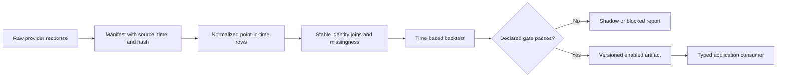

# Data and models

## Evidence taxonomy

RosterLab uses several kinds of evidence. They are intentionally not
interchangeable.

| Evidence | Primary meaning | Current application role |
|---|---|---|
| Sleeper league state | Current rosters, settings, owners, draft, and traded-pick ownership | Team construction and league context |
| Tradyr composite | Attributed current dynasty market comparison | Player/pick market values and trade comparison |
| NFL production model | Expected next-season PPR points per NFL team game | Projected lineup impact when its gate passes |
| Rookie production model | Expected position-relative rookie-season PPR production | Offline validated rookie research; not yet integrated into the site |
| News and trends | Time-sensitive factual catalyst evidence | Advisory signals and watchlist alerts |
| Completed-trade journal | Factual league transaction ledger | Historical manager context and outcome tracking |
| Historical market tape | Dated market observations | Calibration and shadow learning research |
| Trade outcomes | Change after an observed entry snapshot | Evaluation at declared checkpoints |

A market composite is not a production forecast. Production is not resale
profit. News is not causation. A completed trade is not evidence of every
rejected negotiation.

## Source boundaries

### Sleeper

Sleeper's public API supplies league facts, rosters, users, transactions,
trending additions/drops, drafts, and current traded-pick ownership.

Important identity rule: a `roster_id` belongs to one league-season. Follow
`previous_league_id` and store season-specific roster-to-owner mappings before
comparing historical behavior with current managers.

Sleeper does not expose private chat, direct messages, rejected offers,
counters, or negotiation rationale through the public API. Do not claim those
records exist in the journal.

### Tradyr

Tradyr provides permitted, attributed composites derived from public dynasty
sources. The application uses its player and pick endpoints for current market
comparisons. KeepTradeCut is not scraped directly.

Store the provider's generation/version timestamp with observations. A current
composite captured during a historical backfill is retrospective and cannot be
called the original trade price.

### Future picks today

Sleeper determines factual pick identity and ownership: the pick remains tied
to its original roster ID even after its current owner changes. An exact slot is
used only when the current draft supplies a slot-to-roster mapping.

For an unresolved future pick, the application currently uses the matching
Tradyr middle-tier average as its neutral expected value and retains the
provider-derived early-to-late range. Manager-direction labels are manual
context or a neutral placeholder and do not alter that value. This is not a
pick-slot forecast; a class-strength or original-owner forecast must remain
blocked until its own historical model passes validation.

### News and trends

The Worker reads configured NFL RSS sources and Sleeper trend endpoints. It
normalizes headlines, collapses likely duplicates, applies a bounded factual
event classifier, and stores only confidently matched events for alerts.

Source reliability constants and headline rules are advisory heuristics, not a
trained return model. They cannot change market price or a production forecast
without a separate historical validation gate.

### Offline football data

The Python pipelines use source-specific adapters and local ignored caches.
Current sources include nflverse stats/combine data, cfbfastR college
play-participant data, DynastyProcess/FantasyPros historical ECR snapshots, and
bounded FantasyCalc source research. Each report records provider, retrieval
date, and available source hashes.

## Trade scenarios and Pareto discovery

The Trade Lab evaluates an explicit package through separate factual lenses:

- the literal sum of current Tradyr composites;
- KTC and FantasyCalc player-value package lenses when every player has both
  provider values, with any picks held at their current composite;
- the provider-derived early-to-late range for unresolved picks;
- floor, expected, and ceiling lineup deltas from the enabled production
  artifact;
- current draft-capital flow, roster-space change, and player age at the
  user's declared horizon.

Production scenarios use a strict likely-lineup coverage guard. The current
market-selected lineup before and after the deal must fill every required skill
slot with an enabled projection. Otherwise the corresponding result is null and
the UI displays the observed slot coverage. Market value is never converted
into fallback fantasy points.

Discovery does not collapse those lenses into a score. For a selected target
basket, the application enumerates one-to-three-asset outgoing combinations,
using up to the roster's 50 highest-priced assets, keeps the 60 closest
current-value packages, and marks the non-dominated Pareto set. League-wide
discovery pairs each priced target with its closest package from the same
bounded outgoing pool and returns the non-dominated set across the visible
current-value, lineup-coverage, and declared-window objectives. Deterministic
display ordering is a tie-break only. Neither frontier estimates acceptance or
resale return.

## Data lifecycle

Raw and processed research data remain under ignored paths such as `data/raw`,
`data/processed`, and `ml/artifacts`. Small aggregate reports and deliberately
browser-safe artifacts are committed.

## Veteran production model

The production pipeline predicts next-season PPR points per NFL team game from
prior production, usage, availability, age, and development context. It uses a
later untouched season for the promotion gate and compares against the best
declared simple baseline.

Artifacts:

- `public/data/player-projections.json`
- `public/data/model-health.json`
- `ml/reports/latest.json`

Only an enabled artifact may affect projected lineup impact. It does not change
the player's Tradyr market composite.

## Rookie production model

The rookie pipeline is separate because incoming rookies have no prior NFL
season. Its production target is position-relative rookie regular-season PPR
percentile, including players with zero NFL stats.

The V6.3 decision rule selects the eight highest predictions after rookie
market rank 24. Rolling class evaluation compares that basket with simple
market, NFL draft order, and market-versus-capital-gap rules. The current report
passed its declared sleeper-basket gate.

Artifacts and reports:

- `ml/reports/rookie-model-latest.json`
- `ml/reports/rookie-model-latest.md`
- `ml/reports/rookie-complexity-ledger.md`
- `worker/generated/rookie-board.json`

The pipeline derives the Worker-only artifact from the same in-memory report;
it is not hand-edited. The authenticated `GET /api/rookies` route returns only
the versioned production board, aggregate validation, evidence fields used by
the UI, and active blockers. Raw rows, provider payloads, model binaries, and
shadow market-return forecasts are excluded. The Rookie board remains advisory
and does not alter `Asset.value`, trade scoring, packages, or future-pick values.

The 180/365-day market-return head remains shadow-only because the target is
expert-consensus movement rather than a complete price tape from actual
transactions.

## Historical market and return research

The source-audit pipeline evaluates whether available historical market series
can support a return model. It must address:

- point-in-time coverage and cadence;
- players who later disappear from current catalogs;
- exact league-format compatibility;
- reliable provider identity joins;
- historical news/entity precision and data-use rights;
- separation between expert rankings and completed-trade prices.

Until those gates pass, a market-return forecast cannot change trade values,
packages, or recommendations.

## Trade journal and outcomes

The durable journal follows linked Sleeper league seasons, ingests completed
transactions by week, records coverage failures, and stores season-specific
manager identities. It values a new trade at ingestion when possible and marks
older initial valuations as retrospective backfills.

Outcome checkpoints are scheduled at 7, 30, 90, and 180 days. A missing initial
snapshot blocks a legitimate before/after return claim. Outcome evidence should
evaluate the decision process, not retroactively rewrite its entry thesis.

## Promotion states

Use these states consistently:

- **Validated/enabled:** the exact claimed decision passed its declared
  out-of-time gate and may affect only the named application surface.
- **Advisory:** factual or heuristic evidence may be displayed but does not
  automatically change a model value.
- **Shadow:** calculated and evaluated, but unable to change user-facing
  recommendations.
- **Blocked:** a required source, label, sample, identity, or validation gate is
  missing.

Passing one target does not promote another. Rookie production passing does not
validate rookie resale profit; next-season PPG passing does not validate news
impact.

## Adding a new model or feature family

Before implementation, document:

1. the decision and prediction anchor;
2. the exact target and observer;
3. the data knowable at that anchor;
4. the historical population, including failures;
5. the simple baseline;
6. the time-based holdout;
7. the promotion metric and failure slices;
8. the application surface allowed to consume it;
9. the shadow/blocked behavior;
10. the source and deletion/replacement path.

Prefer a bounded offline experiment. Do not add online inference, a queue, or a
new database until a promoted capability requires it.
